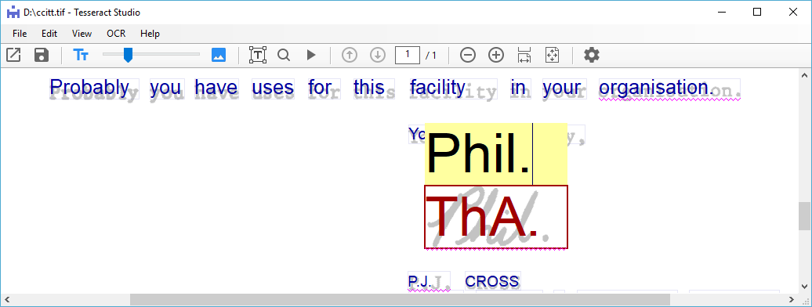
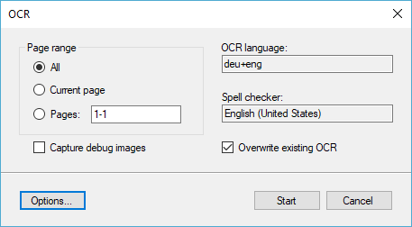
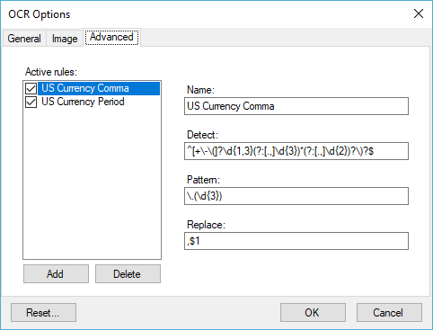
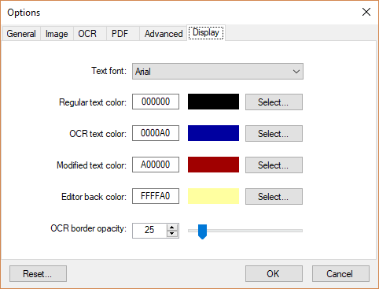

# Introduction
Tesseract Studio .Net is a Windows program to create, review and correct 
OCR data in searchable PDF files using [Tesseract 4.0](https://github.com/tesseract-ocr/) engine.

# Features
-   Supports image and multipage PDF files, with or without prior OCR
    data.

-   Can run or re-run the Tesseract OCR process the current page, all
    pages or selected pages.

-   Preserves any visible text on a PDF page while performing OCR on the
    image elements only.

-   For multi-page files, multiple instances of the tesseract engine run
    in parallel for improved performance. The speed improvement depends
    on the number of processor cores.

-   Identify and display OCR text at the word level with detected word
    boundaries visible.

-   The built-in spell checker automatically tags words not found in the
    dictionary.

-   Display PDF pages in the following modes:

    -   Image with OCR text hidden

    -   OCR text visible and image hidden

    -   OCR text visible on faded image

-   Use any installed font to display OCR text. Fonts are automatically
    scaled to fit word boundaries.

-   Click on a visible word to open a text editor to correct OCR
    mistakes.

-   Split a selected word at the current cursor position into two words,
    or merge the selected word with the next word.

-   Modify or move word boundaries.

-   Create new OCR words, delete existing words.

-   Supports any number of Undo and Redo operations.

-   Save corrections as searchable PDF files. Optionally save as PDF/A 
    or encrypted PDF files.
     
-   Experimental support for removing grid lines and handling a mixed-mode
    page with both light text on dark background and dark text on light
	background. This is common with table headers.
	
-   Capture and examine debug intermediary images and OCR output in text.

# License
Tesseract Studio is released under [Opait Freeware](LICENSE.md) license which allows any legal use for free. The only limitation is that the product cannot be sold for a fee.

# Installation
Tesseract Studio is packaged as a Windows MSI and can be downloaded from
the product web site:

> <https://www.opait.com/tesseractstudio>

# Acknowledgments
[Tesseract OCR](https://github.com/tesseract-ocr/) Apache License Version 2.0

[Leptonica](http://www.leptonica.com) by Dan Bloomberg [Creative Commons Attribution 3.0 United States License]http://creativecommons.org/licenses/by/3.0/us/)

[Pdfium](https://pdfium.googlesource.com/pdfium/) Copyright 2014 PDFium Authors. All rights reserved.

[Hunspell](https://github.com/hunspell/hunspell/blob/master/license.hunspell) Copyright © 2002-2017 Németh László

[NHunspell](http://www.crawler-lib.net/nhunspell) Copyright © Maierhofer Software

# User Guide
In this section we will use a classic TIFF sample file from CCITT which
has been converted to a searchable PDF using Tesseract OCR 4.0. You may
download the file from here:
[ccitt.pdf](https://www.opait.com/tesseractstudio/help/ccitt.pdf)

We could also start with the original TIFF file and perform the OCR
processing within the Tesseract Studio as described later in this
document.

The PDF page is currently in the image display mode which shows the
original TIFF image with the OCR text hidden behind the image.

## Display Modes
The slider on the toolbar controls relative opacities of the text and
image layers:

Mode                  | Toolbar
----------------------|------------------------------------------------
  Image Mode          | 
  Text Mode           | 
  Text Overlay Mode   | 
  Layout Mode         | 

You may also toggle quickly between image and text modes by pressing the
text or image icons at the two ends of the slider bar. OCR data can be
corrected in one of text or the text overlay modes.

## Text Mode

The page is displayed in the text mode with the image layer hidden. The
display font, text colors and the opacity of word boundaries can all be
controlled using the options dialog.

## Text Overlay Mode

The page is displayed in text overlay mode where the original image is
visible in the background at opacity level determined by the position of
the slider bar.

## Layout Mode
The layout mode toggles between correcting OCR text and correcting the
layout of the OCR words.

  **Layout Mode is Off**              | **Layout Mode is On**
  ------------------------------------| ------------------------------------------
  Edit text of a recognized word      | Resize the bounding rectangle of word
  Split a word at the current cursor  | Move the bounding rectangle horizontally
  Merge a word with the next word     | Add a new word
 &nbsp;                               | Delete a word

## Correcting Recognition Mistakes
The only OCR mistake in this document is the cursive signature which has
been mis-recognized as "ThA." instead of "Phil.". To correct this
problem, we click on the word which opens an edit box, allowing us to
replace the text:

## Correcting Segmentation Mistakes
Another type of OCR mistake which originates from the layout analysis is
when the OCR engine breaks a word into two or more words or lumps
adjacent words together. The space character is invisible to the OCR
process. The decision to insert one or more spaces between characters
needs to rely on algorithms that either use heuristics or machine
learning to perform text segmentation. Such algorithms are not always
perfect. In fact, whether or not one or more spaces were intended
between characters of an image is often ambiguous, even to the human
eyes, without considering the context of the characters.

Tesseract studio can correct these mistakes by splitting a word at the
cursor location or by merging two adjacent words. In both cases, you
need to select a word and then right click and use the context menus to
split or merge words.

In the example above, we have split SLEREXE to two words SLER and EXE.
We have also merged the two words COMPANY LIMITED into a single word.
These are, of course, for illustration purposes.

## Undo / Redo
To restore the original words, you can use the Undo button or press
Ctrl+Z several times.

The software supports unlimited levels of Undo and Redo operation.

## Correcting Layout Mistakes
The OCR engine will occasionally create spurious words (e.g. recognize a
vertical line segment as 'I' or '\]'), miss a word altogether
(especially true if some text are in inverted colors, white on gray) or
misplace word location horizontally (artifact of classification). The
layout mode is provided to correct such mistakes.

**Move or Resize Word**

To move or resize a recognized word, make sure the layout mode is on and
click the bounding rectangle of the word. The rectangle will be selected
and can be moved or resized horizontally.

**Delete Word**

To delete a word, select the bounding rectangle in the layout mode and
use keyboard Del key or the menus to delete the word and its bounding
rectangle.

**Add New Word**

To add a new word, select the layout mode and move the mouse cursor to
where you wish to insert the word. A new word can only be added to an
existing text line. The cursor will change to a cross hair cursor when
it detects an existing text line. Draw a bounding rectangle for the new
word and enter its text value. The new word will inherit its attributes,
such as font size, from a neighboring word.

## Running OCR
You may run the OCR process on the current document by clicking the
selecting the "Start OCR..." command under the OCR menus. Tesseract
Studio will create new OCR data for the current page, all pages in the
document or for a selected number of pages.

The OCR process will delete any existing OCR data on a page, including
all edits made to the data. It will, however, preserve and combine any
non-OCR text elements that might already be on a page. The original
graphics of the page will also be preserved.

This approach has several advantages over the customary approach of
rasterizing the entire PDF page and running the resulting monochrome
image through the OCR engine:

-   Protects fidelity, accuracy and font attributes of regular text.

-   Excludes graphical paths such as line drawings from the OCR engine.

-   Reduces the amount of text that the OCR needs to process.

-   Maintains original look of mixed-mode (text, image, graphics) pages.

When running the OCR process on multiple pages, Tesseract Studio will
automatically create multiple instances of the tesseract OCR engine and
run them in parallel to improve the performance. The performance
improvement depends on the number of processing cores in the computer.

To run the OCR process, select the "Start OCR..." command from the OCR
menus, specify the pages that you wish to process and click the Start 
button.

## OCR Options
Various options that control how the OCR is performed can be set from the
dialog accessible via the Options... button on the OCR dialog.

### General Tab

On the General tab, you can select OCR and spelling languages as well as 
the number of parallel processes that can be used to accelerate OCR of 
multi-page documents.

The selection of the OCR and spelling languages is limited to the languages
files that have been installed in the computer. You may install or remove
these language files using the Manage Languages option:

You may also choose more than one language for processing multi-lingual 
documents. The spell-checker, however, can only use a single (primary) 
language.

Selection of multiple languages will be reflected on the OCR dialog 
(e.g. deu+eng for documents that have both German and English text):

### Image Tab

The Image tab displays a few experimental image enhancement options for
dealing with more complex documents. Depending on the source images, these
options may or may not affect the accuracy of the OCR data. More options
will be added to this list in subsequent releases. 

If you check the "Capture debug images" option on the OCR dialog, the 
intermediate images that result from applying image options to the source
images will be captured in a PDF file and displayed after OCR is completed.
This PDF will also include the unformatted OCR text as the last page. This
is designed for examining the effectiveness of various image enhancement
choices.

### OCR Tab
The OCR tab controls how the pages are processed through the OCR engine and
has options in saving the processed files in the PDF format. 

The type of the OCR performed depends on the source document format:

- **Image only** applies to PDF source documents that may have both image 
and text components. This option will preserve the existing text and OCR
only image components embedded in the source PDF. 

- **Full page** will igone existing text components in PDF files and 
apply OCR to a fully rasterized image of the PDF source document. For image
source documents, this is the only option. Even for a PDF document with both 
text and images, you may want to perform a full OCR depending on the 
application. For instance, there might be invisible text on the PDF page 
that will be eliminated by this method. Full page is often slower than the
images only option for vector PDF files.

The save format of OCR output is always a PDF page. The type of the page
can be selected using one of the options below:

- **Vector PDF** is only available for PDF source files that are processed
using the images only OCR option. The full fidelity of the source PDF is
retained and existing text is merged with hidden OCR text.

- **Searchable image PDF** is a rasterized PDF page with the text hidden
behind the image. This option enables you to control the size of the file
by selection the image resolution and color depth.

- **Text only PDF** uses a visible font to display the recognized text
on a PDF page. The text is formatted and placed in roughly its original 
location to preserve the page layout. This option will produce the smallest
output file by dropping all graphical components from the source file.

The fonts available to save text only PDF files depends on whether you 
select to embed the font into the target PDF file. If font is not embedded,
then you only use the standard type 1 fonts that are supported by all PDF
readers. Embedded fonts will make the size of the PDF larger.

### Advanced Tab
The Advanced tab uses regular expressions to post process OCR data and make
certain substitutions based on patterns detected in the OCR data. The two
included rules try to detect and correct common OCR mistakes with currency
amounts that are in US format. These expressions are for illustration only.

## Technical Discussion on Searchable PDF Files
A searchable PDF file is normally constructed by placing the OCR data in
invisible mode behind a scanned image and roughly in correct layout and
location. Tesseract uses a zero-glyph font for representing the OCR
data. It does not reliably detect font families, attributes or sizes. It
also discards character boundaries when creating PDF files.

The OCR data is stored as words within a bounding rectangle. The
characters of a word are assigned the same width which is computed so
that the word fills the bounding rectangle with the character boxes
touching. The important parameters of this approach are the Unicode
values of the characters and the bounding rectangles of the words.

When making the OCR data visible, we have to choose an installed font,
such as Arial, and compute the actual font sizes so that the OCR words
roughly fit the bounding rectangles. Since, in reality characters vary
widely in width, this mapping is not perfect. The choice of the font
size and the rendered width of words are not important. When adding or
re-sizing word, it is important to pay attention to the bounding
rectangles and not display widths.

On some occasions it might be easier to merge adjacent words and enter a
multi-word phrase with explicit spaces separating words. Most PDF
viewers will be fine with using explicit space characters to identify
word boundaries.

## Display Options
The General tab on the options dialog allows setting of fonts, colors 
and borders for rendering images and text.

## PDF Options
You may use the PDF tab on the options dialog to select parameters that
will apply to all subsequent OCR operations. The PDF/A option will create
PDF files that conform to the PDF/A standard for archiving. You may also 
choose to save PDF files encrypted with a password. You may only use one
of these options as PDF/A does not allow encryption.

  

# More from Opait Software
[**Opait PDF Creator**](https://www.opait.com/pdfcreator)

Opait PDF Creator is high-performance application which uses managed
parallel processes to enable production grade automation of the new
Tesseract 4.0 OCR engine. It provides a framework for managing multiple
configurable jobs to monitor the file system for qualified files and
perform conversion to searchable PDF documents.

Opait PDF Creator has a fully multi-threaded kernel acting as a
high-performance document processing server that works with a set of
watched folders. As images and image-based PDF files are placed into
these folders, or arrive automatically via file transfer, the Opait PDF
Creator places them into a managed queue and takes care of tasks like
file locking, events handling and communicating with user or API
processes.

In time-critical or high-volume environments, multiple instances of the
Opait PDF Creator may be deployed to increase performance.

The Opait PDF Creator also supports a plugin API to customize the
workflow and integrate with third-party applications.

 

[**About Opait Software**](https://www.opait.com/)

Opait Software specializes in high quality extraction of structured data
such as fields, tables, sections and paragraphs from unstructured
documents in many file formats. Automatic identification and extraction
of tabular data, as well as, tagging and filtering NLP elements of PDF
documents allows advanced analytics, RPA automation and semantic search
using data trapped in PDF and other unstructured documents. These
data-mining products are particularly suited to financial modeling and
analysis. Automatic processing of statements, remittances, bills,
financial reports and contracts are some applications of this
technology.
